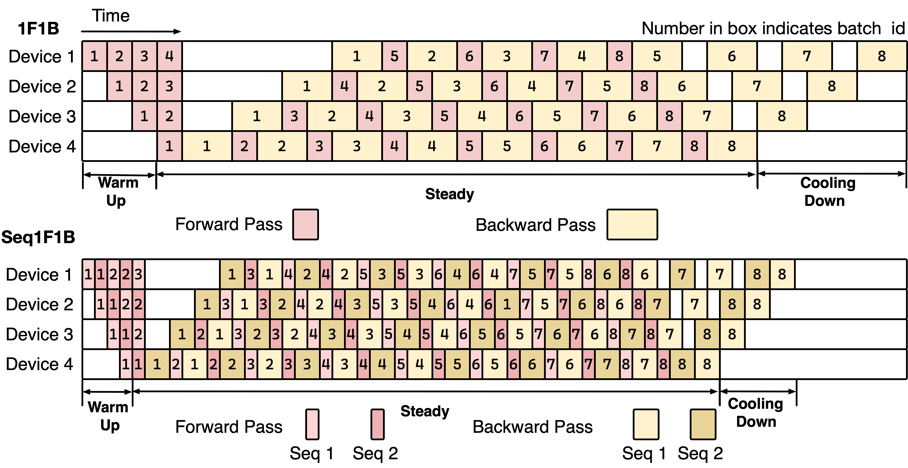
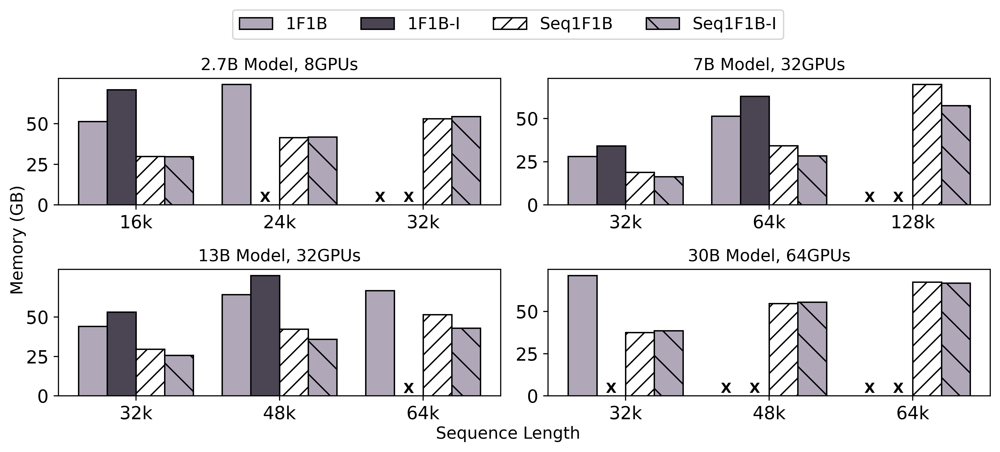

<div align="center">
  
# Seq1F1B 长序列训练高效流水线并行算法

<p align="center">
  <a href="./README.md">English</a> •
  <a href="https://arxiv.org/abs/2406.03488">论文</a>
</p>

</div>

欢迎来到Seq1F1B仓库！Seq1F1B是一种高效的序列级别的1F1B（one-forward-one-backward）流水线调度算法，为强化大模型长序列分布式训练而设计。该算法基于Megatron-LM框架，并引入全新的策略进行显存优化和减少流水线气泡。

## 简介

近年来，流水线并行已成为大语言模型分布式训练的重要技术。然而，随着训练序列长度达到32k甚至128k，现有的流水线并行方法常常面临高内存占用和显著的气泡大小问题，从而影响训练效率。Seq1F1B通过将批次级别的可调度单元分解为更细粒度的序列级别单元来解决这些挑战，从而改善工作负载平衡并减少内存使用。

Seq1F1B支持使用64个NVIDIA A100 GPU高效训练具有300亿参数的大语言模型，序列长度可达64k，且无需使用重计算策略。这种性能水平是当前流水线并行方法无法达到的。

## 特色

- **细粒度可调度单元**：将批次级别单元分解为序列级别单元，以增强工作负载平衡。
- **减少内存占用**：优化内存使用，允许训练更长的序列。
- **更小的流水线气泡**：高效调度减少流水线阶段的空闲时间。
- **可扩展训练**：能够使用64个NVIDIA A100 GPU训练具有300亿参数的大语言模型，序列长度可达64k。
- **基于Megatron-LM**：建立在稳健且广泛使用的Megatron-LM之上。

|  |
|:--:|
| *Seq1F1B时间线* |

## 安装方法

要开始使用Seq1F1B，请按照以下步骤操作：

1. 克隆仓库：
   ```bash
   git clone https://github.com/your-repo/Seq1F1B.git
   cd Seq1F1B
   ```

2. 安装所需依赖：
   ```bash
   pip install -r requirements.txt
   ```

## 使用方法
Seq1F1B无缝集成到Megatron-LM。下面给出使用Seq1F1B进行训练的一个实例：

1. 准备好数据集与配置文件。这里我们以codeparrot数据集为例：
   ```python
   from datasets import load_dataset
   train_data = load_dataset('codeparrot/codeparrot-clean-train', split='train')
   train_data.to_json("codeparrot_data.json", lines=True)  
   ```
   ```bash
   pip install nltk
      python tools/preprocess_data.py \
       --input codeparrot_data.json \
       --output-prefix codeparrot \
       --vocab vocab.json \
       --dataset-impl mmap \
       --tokenizer-type GPT2BPETokenizer \
       --merge-file merges.txt \
       --json-keys content \
       --workers 32 \
       --chunk-size 25 \
       --append-eod
   ```

2. 运行Seq1F1B流水线并行训练脚本：
   ```bash
   bash exp.sh 
   ```

有关详细使用说明和配置选项，请参阅我们的[documentation](docs/README.md)。

## 结果

Seq1F1B相比现有方法展现出显著改进：

- **内存效率**：减少内存占用，无需重计算即可训练更长序列。
- **性能**：实现更小的流水线气泡，从而缩短训练时间。
- **可扩展性**：支持在现代GPU集群上进行大规模训练。

|  |
|:--:|
| *Seq1F1B与现有方法的内存使用对比。* |

## 贡献

我们欢迎社区的贡献！如果您遇到任何问题或有改进建议，请开启一个issue或提交pull request。

## 许可证

Seq1F1B基于原始Megatron的许可证发布。有关更多详细信息，请参阅[LICENSE](LICENSE)文件。

## 致谢

Seq1F1B建立在Megatron-LM框架之上。我们感谢Megatron-LM开发团队的出色工作和支持。

## 未来展望

我们计划发布我们的代码和进一步改进，以推进长序列大语言模型的训练。敬请期待更新！

## 引用
如果您使用了这个代码库，或者发现我们的工作有价值，请引用：
```bibtex
@article{ao2024seq1f1b,
  title={Seq1F1B: Efficient Sequence-Level Pipeline Parallelism for Large Language Model Training},
  author={Ao, Sun and Zhao, Weilin and Han, Xu and Yang, Cheng and Liu, Zhiyuan and Shi, Chuan and Sun, Maosong},
  journal={arXiv preprint arXiv:2406.03488},
  year={2024}
}
```
